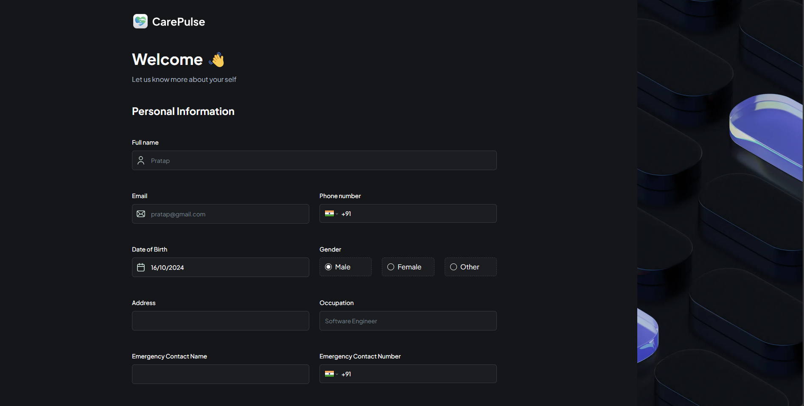

This is a basic healthcare project:

# Functionality:

1. User can login with email and phone.
2. After login user has to register by providing all the details along with identification proof.
3. Once registration is completed then user can to create new appointments.
4. Once appointment is created by the user then Admin can see them on their dashboard in pending state.
5. Admin can confirm the appointments or cancel it based on doctor availablity.
6. A message will be send to user based on the action performed by Admin => Schedule/ Cancel.

# TechStack Used:

1. Nextjs + React + Typescript + Tailwindcss + ESLint - Framework setup, Routing, styling.
2. React Hook Form - Forms creation.
3. Zod - Form validation library.
4. Shadcn - UI library
5. Appwrite - For Backend DB setup - collections to save doctor, patient and appointment data and storage bucket to save documents.
6. Twilio - For sending messages to end user phone number.

# UI - HomePage:

# UI - RegisterPage:

# UI - Appointment Page:

# UI - Appointment Success Page:

# UI - Admin passkode modal:

# UI - Admin page:

